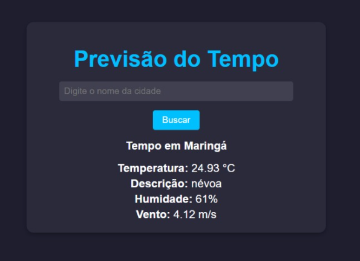

# CI/CD Pipeline para Aplicação Web com Deploy na AWS


Este projeto exemplifica a criação de um pipeline CI/CD robusto para uma aplicação web de previsão do tempo, construída com Flask e Docker. Utilizando a API do OpenWeatherMap, a aplicação é totalmente automatizada desde a construção até o deploy. O pipeline inclui integração com GitHub Actions para automação de build e testes, e usa Terraform e Ansible para a configuração e deploy automatizado na AWS. Este projeto visa demonstrar práticas avançadas de DevOps, como criação de imagens Docker, deploy contínuo e integração contínua, aplicando as melhores práticas para garantir uma entrega eficiente e segura.




## Funcionalidades

- Automação de build e testes com GitHub Actions
- Criação de imagem Docker e push para Docker Hub
- Deploy automatizado na AWS (EC2, S3)
- Provisionamento de infraestrutura com Terraform
- Configuração de servidores com Ansible
- Integração com Slack, Microsoft Teams ou e-mail (via SendGrid/AWS SES) para notificações de build e deploy
- Testes de segurança automatizados

## Tecnologias Utilizadas

- **Linguagem/Framework**: Flask (Python)
- **Docker**: Para containerização da aplicação
- **GitHub Actions**: Para automação do pipeline CI/CD
- **Terraform**: Para provisionamento de infraestrutura como código (EC2, S3)
- **Ansible**: Para automação e configuração de servidores
- **AWS**:
  - **EC2**: Para hospedar o backend da aplicação
  - **S3**: Para hospedar o frontend
- **Notificações**:
  - **E-mail**: Integração com AWS SES

## Como Executar Localmente

### Pré-requisitos

Certifique-se de ter o Docker, Docker Compose, Terraform e Ansible instalados em sua máquina.

### Passo a Passo

1. Clone o repositório:
   ```bash
   git clone https://github.com/AlanBReis/ci-cd-aws-deploy

2. Acesse o diretório do projeto:
    ```bash
    cd ci-cd-aws-deploy
    ```
3. Configure as variáveis de ambiente no arquivo `.env` (veja o exemplo no `.env.example`).
4. Construa e execute os containers Docker:
    ```bash
    docker build -t weather-app .
    docker run -p 5000:5000 weather-app
    ```
5. Acesse a aplicação em `http://localhost:5000`.

## Pipeline CI/CD
O workflow do GitHub Actions executa as seguintes etapas:
1. **Build:** Construção da aplicação.
2. **Testes:** Execução de testes automatizados.
3. **Linting:** Verificação de qualidade do código.
4. **Imagem Docker:** Criação e push da imagem para o Docker Hub.
5. **Provisionamento de Infraestrutura com Terraform:** Cria a infraestrutura na AWS, como instâncias EC2 e buckets S3.
6. **Configuração de Servidores com Ansible:** Após o provisionamento, o Ansible é usado para configurar as instâncias EC2, instalando dependências como Docker e preparando o ambiente para o deploy.
7. **Deploy Automatizado:** Deploy na AWS usando EC2.
8. **Notificações:** Envia status das builds e deploys.

## O pipeline CI/CD é gerenciado pelo GitHub Actions e executa as seguintes etapas:

1. **Build**: Constrói a aplicação.
2. **Criação de Imagem Docker**: Cria a imagem Docker e faz o push para o Docker Hub.
3. **Provisionamento de Infraestrutura com Terraform**: Cria a infraestrutura na AWS (EC2,S3).
4. **Configuração de Servidores com Ansible**: Configura as instâncias EC2 após provisionadas.
5. **Deploy Automatizado**: Realiza o deploy da aplicação nas instâncias EC2.
6. **Notificações**: Envia notificações para Slack, Teams ou e-mail.

Para ver o arquivo completo do workflow, [clique aqui](D:\PROGRAMMER\ci-cd-aws-deploy\.github\workflows\main.yml).


## Deploy na AWS
1. **EC2:** A aplicação backend será hospedada em uma instância EC2. O deploy automatizado é feito através do pipeline CI/CD do GitHub Actions, com infraestrutura provisionada por Terraform e configurada por Ansible.
2. **S3:** Para hospedar o frontend.

## Notificações
As notificações podem ser enviadas para a plataforma:

E-mail: Configurado através de serviços como SendGrid ou AWS SES para enviar atualizações sobre o pipeline por e-mail.

## Como Contribuir
1. Fork o projeto.
2. Crie uma branch (`git checkout -b feature/nova-funcionalidade`).
3. Faça o commit das suas alterações (`git commit -m 'Adiciona nova funcionalidade'`).
4. Envie para o repositório remoto (`git push origin feature/nova-funcionalidade`).
5. Crie um Pull Request.

## Licença
Este projeto está licenciado sob a [MIT License](./LICENSE).

